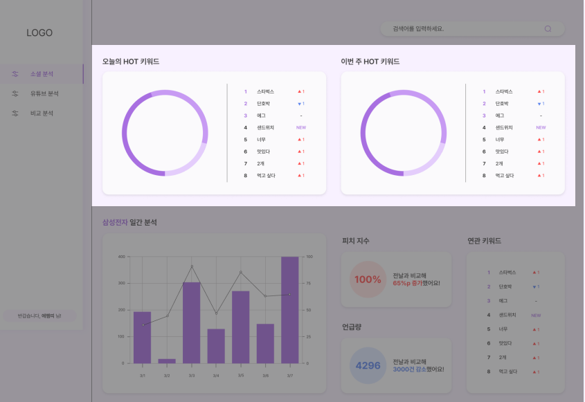
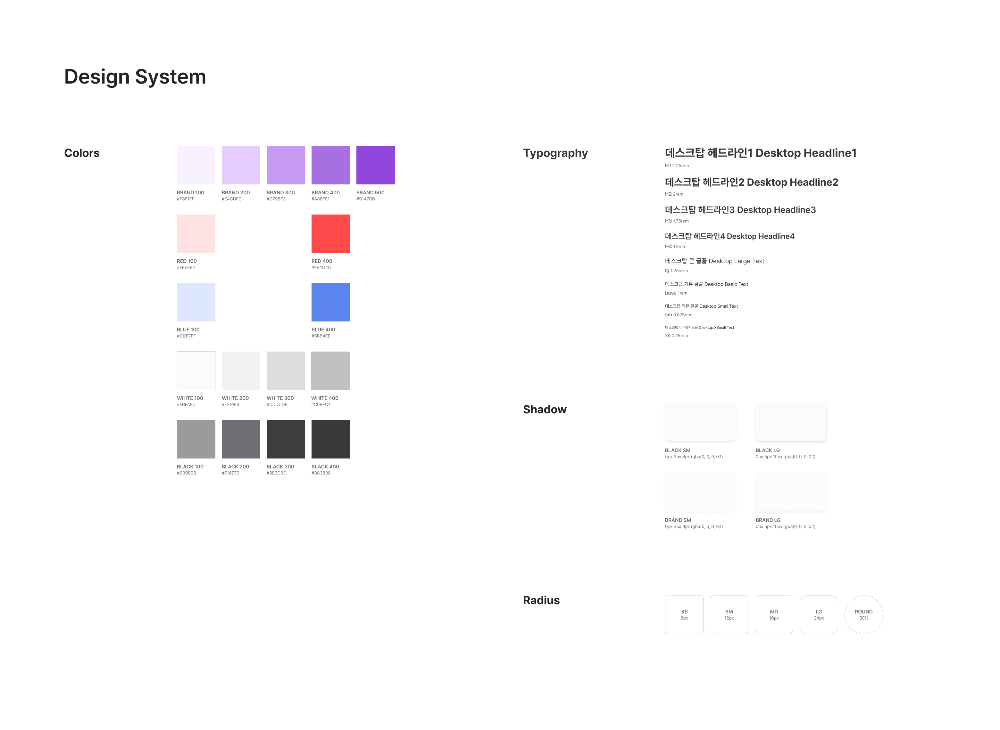

# **📺 TRENDFLOW : 소셜 미디어 분석 서비스**

## **❗ 프로젝트 기간**
---
    2022.02.27 ~ 
 

## **❗ 팀구성**
---
- 팀장
    - 박상민 
- 팀원
    - 권혁근
    - 김수민
    - 김보경
    - 김진호
    - 문석환

 

## **❗ 기획 배경**
---
**브랜드 마케터의 업무 중 3가지 애로사항**

1. 막대한 양의 정보
   - 정보의 양이 너무 많아서 특정 키워드의 전체적인 동향을 파악하는 데 시간이 많이 소요됨
2. 부족한 일관성
   - 개인의 판단에 의해 긍, 부정 평가가 결정됨
3. 실시간 파악 어려움
   - 진행중인 전략에 대한 고객의 반응을 실시간으로 파악하기가 어려움

 

## **❗ 주요 기능**
---
### **✨ 일간 및 주간 분석**

- 키워드의 언급량 비율과 순위를 일간과 주간 기준으로 살펴볼 수 있다.

- 관심 있는 키워드를 등록하면 매일 일간 분석 진행.
- 언급량 및 긍정 지수의 변화량을 시각화한 자료를 확인할 수 있고, 등록한 키워드와 함께 검색된 연관 키워드들도 조회 가능
---
### **✨ 소셜 분석**

- 설정한 기간 만큼의 데이터를 분석한 결과를 제공
- 언급량과 긍정지수가 나타나는 일간 차트를 기본적으로 제공

- 연관된 키워드를 워드 클라우드로 한 눈에 확인 가능

- 긍부정 지수와 검색 엔진 트렌드의 변화 추이를 일간 꺾은선 그래프로 제공

- 키워드 관련 컨텐츠 ( 기사, 블로그, 유튜브 등 ) 조회 가능

---
### **✨ 유튜브 분석**

- 검색창에 유투브 링크를 입력하면 해당 영상에 달린 댓글을 분석해주는 서비스

- 영상에 달린 댓글에 대한 반응을 시각화된 자료로 한눈에 확인할 수 있고, 선호도 별로 가장 많이 언급된 키워드도 확인 가능

 

## ❗ **기대효과**
---
- 키워드 별로 다양한 소스에서 방대한 양의 데이터를 수집하여 분석한 결과를 시각화 하여 보여주기 때문에 트렌드 추이를 한 눈에 파악하여 브랜드 마케터의 업무에 도움이 된다.
- 오늘의 HOT 키워드, 이번주 HOT 키워드 등을 제공하기 때문에 키워드 별로 말고도 전반적인 트렌드 파악를 파악할 수 있다.

 

## ❗ **아키텍처**
---

 

## ❗ **데이터 파이프라인**
---

 

## ❗ **디자인 시스템**

 

📄 [API 명세서](https://www.notion.so/API-a22b363b35c046ddac2e92edadb66459)

📄 [Figma](https://www.figma.com/file/F58hg1zE3Mt0ydG7hdxCI5/%EC%97%90%ED%97%B4%EB%9D%A0?node-id=0%3A1&t=1eXcrBPJlRr9l9Mw-1)

📄 [기능 명세서](https://www.notion.so/53a58c349c8e41c4960fce57e6a80fff)
