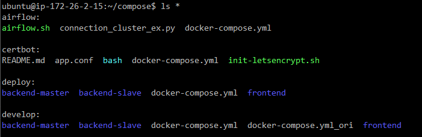

# TRENDFLOW 포팅메뉴얼

상태: Convention

# ❗ 도커 설치

```bash
# 필수 패키지 설치
sudo apt-get install apt-transport-https ca-certificates curl gnupg-agent software-properties-common

# GPG Key 인증
curl -fsSL https://download.docker.com/linux/ubuntu/gpg | sudo apt-key add -

# docker repo 등록
sudo add-apt-repository \
"deb [arch=amd64] https://download.docker.com/linux/ubuntu \
$(lsb_release -cs) \
stable"

# docker 설치
sudo apt-get update && sudo apt-get install docker-ce docker-ce-cli containerd.io
```

# ❗ 개발 환경

```yaml
# docker-compose.yml
version: "3"

services:
  mysql:
    container_name: mysql
    image: mysql:latest
    ports:
      - 3306:3306
    restart: always
    environment:
      - MYSQL_ROOT_PASSWORD=trendflow205.!
    volumes:
      - /exthdd/docker/develop-tool/mysql:/var/lib/mysql
    networks:
      develop-tool-net:
        ipv4_address: 10.0.0.10

  auth-redis:
    container_name: auth-redis
    image: redis:7.0.8
    ports:
      - 6379:6379
    restart: always
    volumes:
      - /exthdd/docker/develop-tool/auth-redis/conf/redis.conf:/etc/redis/redis.conf
      - /exthdd/docker/develop-tool/auth-redis/data:/data
    command: redis-server /etc/redis/redis.conf
    networks:
      develop-tool-net:
        ipv4_address: 10.0.0.11

  cache-redis:
    container_name: cache-redis
    image: redis:7.0.8
    ports:
      - 6380:6379
    restart: always
    volumes:
      - /exthdd/docker/develop-tool/cache-redis/conf/redis.conf:/etc/redis/redis.conf
      - /exthdd/docker/develop-tool/cache-redis/data:/data
    command: redis-server /etc/redis/redis.conf
    networks:
      develop-tool-net:
        ipv4_address: 10.0.0.12

  jenkins:
    container_name: jenkins
    image: jenkins/jenkins:2.375.1
    stdin_open: true
    tty: true
    ports:
      - 9090:8080
      - 50000:50000
    restart: always
    volumes:
      - /exthdd/docker/develop-tool/jenkins:/var/jenkins_home
      - /exthdd/docker/develop/frontend:/var/jenkins_home/build/develop/frontend
      - /exthdd/docker/develop/backend-eureka:/var/jenkins_home/build/develop/backend-eureka
      - /exthdd/docker/develop/backend-gateway:/var/jenkins_home/build/develop/backend-gateway
      - /exthdd/docker/develop/backend-analyze:/var/jenkins_home/build/develop/backend-analyze
      - /exthdd/docker/develop/backend-common:/var/jenkins_home/build/develop/backend-common
      - /exthdd/docker/develop/backend-keyword:/var/jenkins_home/build/develop/backend-keyword
      - /exthdd/docker/develop/backend-member:/var/jenkins_home/build/develop/backend-member
    networks:
      develop-tool-net:
        ipv4_address: 10.0.0.50
      develop-net:
        ipv4_address: 20.0.0.50

networks:
  develop-tool-net:
    name: develop-tool-net
    driver: bridge
    ipam:
      config:
        - subnet: 10.0.0.0/24
          gateway: 10.0.0.1
  develop-net:
    name: develop-net
    driver: bridge
    ipam:
      config:
        - subnet: 20.0.0.0/24
          gateway: 20.0.0.1
```

```bash
# redis.conf
protected-mode no
appendonly yes
requirepass [비밀번호]
```

# ❗ 배포 환경

```docker
# backend-master (Eureka, Gateway)
# 기준이미지 설정
FROM ubuntu:20.04

# default user
ENV USER trendflow
ARG PW=trendflow205.!

# 필요한 패키지 설치 (sudo, nano, net-tools, ssh, java, nginx)
RUN apt-get update && apt-get upgrade -y
RUN apt-get install -y sudo nano ssh openssh-server openjdk-8-jdk-headless nginx

# Access Option
RUN sed -i 's/UsePAM yes/#UserPAM yes/g' /etc/ssh/sshd_config

# $USER 계정 생성
RUN groupadd -g 999 $USER
RUN useradd -m -r -u 999 -g $USER $USER
RUN sed -ri '20a'$USER' ALL=(ALL) NOPASSWD:ALL' /etc/sudoers

# root, $USER의 페스워드를 지정
RUN echo 'root:root' | chpasswd
RUN echo $USER':'$PW | chpasswd

# ssh를 시작 프로세스에 등록
RUN sudo echo 'sudo service ssh restart' >> /home/$USER/run.sh

# nginx를 시작 프로세스에 등록
RUN sudo echo 'sudo service nginx start' >> /home/$USER/run.sh

# backend.sh를 시작 프로세스에 등록
RUN sudo echo 'sh ~/build/backend.sh' >> /home/$USER/run.sh

# Jenkins 공개키 등록
COPY ./jenkins_rsa.pub /home/$USER/jenkins_rsa.pub
RUN mkdir /home/$USER/.ssh
RUN cat /home/$USER/jenkins_rsa.pub >> /home/$USER/.ssh/authorized_keys

# java 환경변수 설정
ENV JAVA_HOME=/usr/lib/jvm/java-8-openjdk-amd64

# Entrypoint 지정
ENTRYPOINT sh /home/$USER/run.sh && sh
USER $USER

# 외부포트 설정 (ssh-22, http-8080)
EXPOSE 22
EXPOSE 80
EXPOSE 81
EXPOSE 8080
EXPOSE 44302
```

```docker
# backend-master (Analyze. Common, Keyword, Member)
# 기준이미지 설정
FROM ubuntu:20.04

# default user
ENV USER trendflow
ARG PW=trendflow205.!

# 필요한 패키지 설치 (sudo, nano, net-tools, ssh, java)
RUN apt-get update && apt-get upgrade -y
RUN apt-get install -y sudo nano ssh openssh-server openjdk-8-jdk-headless

# Access Option
RUN sed -i 's/UsePAM yes/#UserPAM yes/g' /etc/ssh/sshd_config

# $USER 계정 생성
RUN groupadd -g 999 $USER
RUN useradd -m -r -u 999 -g $USER $USER
RUN sed -ri '20a'$USER' ALL=(ALL) NOPASSWD:ALL' /etc/sudoers

# root, $USER의 페스워드를 지정
RUN echo 'root:root' | chpasswd
RUN echo $USER':'$PW | chpasswd

# ssh를 시작 프로세스에 등록
RUN sudo echo 'sudo service ssh restart' >> /home/$USER/run.sh

# backend.sh를 시작 프로세스에 등록
RUN sudo echo 'sh ~/build/backend.sh' >> /home/$USER/run.sh

# Jenkins 공개키 등록
COPY ./jenkins_rsa.pub /home/$USER/jenkins_rsa.pub
RUN mkdir /home/$USER/.ssh
RUN cat /home/$USER/jenkins_rsa.pub >> /home/$USER/.ssh/authorized_keys

# java 환경변수 설정
ENV JAVA_HOME=/usr/lib/jvm/java-8-openjdk-amd64

# Entrypoint 지정
ENTRYPOINT sh /home/$USER/run.sh && sh
USER $USER

# 외부포트 설정 (ssh-22, http-8080)
EXPOSE 22
EXPOSE 80
EXPOSE 81
EXPOSE 8080
```

```docker
# Frontend
# 기준이미지 설정
FROM ubuntu:20.04

# default user
ENV USER trendflow
ARG PW=trendflow205.!

# 필요한 패키지 설치 (sudo, nano, net-tools, ssh, nginx)
RUN apt-get update && apt-get upgrade -y
RUN apt-get install -y sudo nano ssh openssh-server nginx

# Access Option
RUN sed -i 's/UsePAM yes/#UserPAM yes/g' /etc/ssh/sshd_config

# $USER 계정 생성
RUN groupadd -g 999 $USER
RUN useradd -m -r -u 999 -g $USER $USER
RUN sed -ri '20a'$USER' ALL=(ALL) NOPASSWD:ALL' /etc/sudoers

# root, $USER의 페스워드를 지정
RUN echo 'root:root' | chpasswd
RUN echo $USER':'$PW | chpasswd

# ssh를 시작 프로세스에 등록
RUN sudo echo 'sudo service ssh restart' >> /home/$USER/run.sh

# nginx를 시작 프로세스에 등록
RUN sudo echo 'sudo service nginx start' >> /home/$USER/run.sh

# Jenkins 공개키 등록
COPY ./jenkins_rsa.pub /home/$USER/jenkins_rsa.pub
RUN mkdir /home/$USER/.ssh
RUN cat /home/$USER/jenkins_rsa.pub >> /home/$USER/.ssh/authorized_keys

# Entrypoint 지정
ENTRYPOINT sudo sh /home/$USER/run.sh && sh
USER $USER

# 외부포트 설정
EXPOSE 22
EXPOSE 443
EXPOSE 5174
```

```bash
# Frontend Container app.conf
server {
        listen 44301 ssl;
        server_name trendflow.site www.trendflow.site;
        server_tokens off;

        location / {
                root /home/trendflow/build;
                index index.html index.htm;
                try_files $uri $uri/ /index.html;
        }

        ssl_certificate /etc/letsencrypt/live/trendflow.site/fullchain.pem;
        ssl_certificate_key /etc/letsencrypt/live/trendflow.site/privkey.pem;
        include /etc/letsencrypt/options-ssl-nginx.conf;
        ssl_dhparam /etc/letsencrypt/ssl-dhparams.pem;

        error_log /var/log/nginx/error.log;
}
```

```bash
# Backend-Gateway Container app.conf
server {
        listen 44302 ssl;
        server_name trendflow.site www.trendflow.site;
        server_tokens off;

        location / {
            proxy_pass http://localhost:8080;
        }

        ssl_certificate /etc/letsencrypt/live/trendflow.site/fullchain.pem;
        ssl_certificate_key /etc/letsencrypt/live/trendflow.site/privkey.pem;
        include /etc/letsencrypt/options-ssl-nginx.conf;
        ssl_dhparam /etc/letsencrypt/ssl-dhparams.pem;

        error_log /var/log/nginx/error.log;
}
```

```bash
# Backend-Eureka Container app.conf
server {
        listen 44303 ssl;
        server_name trendflow.site www.trendflow.site;
        server_tokens off;

        location / {
            proxy_pass http://localhost:8761;
        }

        ssl_certificate /etc/letsencrypt/live/trendflow.site/fullchain.pem;
        ssl_certificate_key /etc/letsencrypt/live/trendflow.site/privkey.pem;
        include /etc/letsencrypt/options-ssl-nginx.conf;
        ssl_dhparam /etc/letsencrypt/ssl-dhparams.pem;

        error_log /var/log/nginx/error.log;
}
```

```yaml
# docker-compose.yml
version: "3"

services:
  # frontend
  deploy-frontend:
    container_name: deploy-frontend
    image: frontend:v1
    stdin_open: true
    tty: true
    ports:
      - 80:80
      - 443:443
    restart: always
    volumes:
      - /exthdd/docker/deploy/frontend:/home/trendflow/build
      - /exthdd/docker/deploy/frontend/app.conf:/etc/nginx/conf.d/app.conf
      - /exthdd/docker/certbot/conf:/etc/letsencrypt
      - /exthdd/docker/certbot/www:/var/www/certbot
      - /etc/localtime:/etc/localtime:ro
    environment:
      TZ: Asia/Seoul
    networks:
      deploy-net:
        ipv4_address: 40.0.0.10

  # backend-eureka
  deploy-backend-eureka:
    container_name: deploy-backend-eureka
    image: backend:v1
    stdin_open: true
    tty: true
    restart: always
    volumes:
      - /exthdd/docker/deploy/backend-eureka:/home/trendflow/build
      - /exthdd/docker/deploy/backend-eureka/app.conf:/etc/nginx/conf.d/app.conf
      - /exthdd/docker/certbot/conf:/etc/letsencrypt
      - /exthdd/docker/certbot/www:/var/www/certbot
      - /etc/localtime:/etc/localtime:ro
    environment:
      TZ: Asia/Seoul
    networks:
      deploy-net:
        ipv4_address: 40.0.0.20

  # backend-gateway
  deploy-backend-gateway:
    container_name: deploy-backend-gateway
    image: backend:v1
    stdin_open: true
    tty: true
    restart: always
    volumes:
      - /exthdd/docker/deploy/backend-gateway:/home/trendflow/build
      - /exthdd/docker/deploy/backend-gateway/app.conf:/etc/nginx/conf.d/app.conf
      - /exthdd/docker/certbot/conf:/etc/letsencrypt
      - /exthdd/docker/certbot/www:/var/www/certbot
      - /etc/localtime:/etc/localtime:ro
    environment:
      TZ: Asia/Seoul
    networks:
      deploy-net:
        ipv4_address: 40.0.0.21

  # backend-analyze
  deploy-backend-analyze:
    container_name: deploy-backend-analyze
    image: backend:v1
    stdin_open: true
    tty: true
    restart: always
    volumes:
      - /exthdd/docker/deploy/backend-analyze:/home/trendflow/build
      - /etc/localtime:/etc/localtime:ro
    environment:
      TZ: Asia/Seoul
    networks:
      deploy-net:
        ipv4_address: 40.0.0.22
      develop-tool-net:
        ipv4_address: 10.0.0.200

  # backend-common
  deploy-backend-common:
    container_name: deploy-backend-common
    image: backend:v1
    stdin_open: true
    tty: true
    restart: always
    volumes:
      - /exthdd/docker/deploy/backend-common:/home/trendflow/build
      - /etc/localtime:/etc/localtime:ro
    environment:
      TZ: Asia/Seoul
    networks:
      deploy-net:
        ipv4_address: 40.0.0.23
      develop-tool-net:
        ipv4_address: 10.0.0.210

  # backend-keyword
  deploy-backend-keyword:
    container_name: deploy-backend-keyword
    image: backend:v1
    stdin_open: true
    tty: true
    restart: always
    volumes:
      - /exthdd/docker/deploy/backend-keyword:/home/trendflow/build
      - /etc/localtime:/etc/localtime:ro
    environment:
      TZ: Asia/Seoul
    networks:
      deploy-net:
        ipv4_address: 40.0.0.24
      develop-tool-net:
        ipv4_address: 10.0.0.220

  # backend-member
  deploy-backend-member:
    container_name: deploy-backend-member
    image: backend:v1
    stdin_open: true
    tty: true
    restart: always
    volumes:
      - /exthdd/docker/deploy/backend-member:/home/trendflow/build
      - /etc/localtime:/etc/localtime:ro
    environment:
      TZ: Asia/Seoul
    networks:
      deploy-net:
        ipv4_address: 40.0.0.25
      develop-tool-net:
        ipv4_address: 10.0.0.230

networks:
  deploy-net:
    name: deploy-net
    driver: bridge
    ipam:
      config:
        - subnet: 40.0.0.0/24
          gateway: 40.0.0.1
  develop-tool-net:
    name: develop-tool-net
    driver: bridge
    ipam:
      config:
        - subnet: 10.0.0.0/24
          gateway: 10.0.0.1
```

# ❗ 배포 테스트 서버 환경

```yaml
# docker-compose.yml
version: "3"

services:
  # frontend
  frontend:
    container_name: frontend
    image: frontend:v1
    stdin_open: true
    tty: true
    ports:
      - 44301:44301
#      - 443:44301
    restart: always
    volumes:
      - /exthdd/docker/develop/frontend:/home/trendflow/build
      - /exthdd/docker/develop/frontend/app.conf:/etc/nginx/conf.d/app.conf
      - /exthdd/docker/certbot/conf:/etc/letsencrypt
      - /exthdd/docker/certbot/www:/var/www/certbot
      - /etc/localtime:/etc/localtime:ro
    environment:
      TZ: Asia/Seoul
    networks:
      develop-net:
        ipv4_address: 20.0.0.10

  # backend-eureka
  backend-eureka:
    container_name: backend-eureka
    image: backend:v2
    stdin_open: true
    tty: true
    ports:
      - 44303:44303
    restart: always
    volumes:
      - /exthdd/docker/develop/backend-eureka:/home/trendflow/build
      - /exthdd/docker/develop/backend-eureka/app.conf:/etc/nginx/conf.d/app.conf
      - /exthdd/docker/certbot/conf:/etc/letsencrypt
      - /exthdd/docker/certbot/www:/var/www/certbot
      - /etc/localtime:/etc/localtime:ro
    environment:
      TZ: Asia/Seoul
    networks:
      develop-net:
        ipv4_address: 20.0.0.20

  # backend-gateway
  backend-gateway:
    container_name: backend-gateway
    image: backend:v2
    stdin_open: true
    tty: true
    ports:
      - 44302:44302
    restart: always
    volumes:
      - /exthdd/docker/develop/backend-gateway:/home/trendflow/build
      - /exthdd/docker/develop/backend-gateway/app.conf:/etc/nginx/conf.d/app.conf
      - /exthdd/docker/certbot/conf:/etc/letsencrypt
      - /exthdd/docker/certbot/www:/var/www/certbot
      - /etc/localtime:/etc/localtime:ro
    environment:
      TZ: Asia/Seoul
    networks:
      develop-net:
        ipv4_address: 20.0.0.21

  # backend-analyze
  backend-analyze:
    container_name: backend-analyze
    image: backend:v1
    stdin_open: true
    tty: true
    restart: always
    volumes:
      - /exthdd/docker/develop/backend-analyze:/home/trendflow/build
      - /etc/localtime:/etc/localtime:ro
    environment:
      TZ: Asia/Seoul
    networks:
      develop-net:
        ipv4_address: 20.0.0.22
      develop-tool-net:
        ipv4_address: 10.0.0.20

  # backend-common
  backend-common:
    container_name: backend-common
    image: backend:v1
    stdin_open: true
    tty: true
    restart: always
    volumes:
      - /exthdd/docker/develop/backend-common:/home/trendflow/build
      - /etc/localtime:/etc/localtime:ro
    environment:
      TZ: Asia/Seoul
    networks:
      develop-net:
        ipv4_address: 20.0.0.23
      develop-tool-net:
        ipv4_address: 10.0.0.21

  # backend-keyword
  backend-keyword:
    container_name: backend-keyword
    image: backend:v1
    stdin_open: true
    tty: true
    restart: always
    volumes:
      - /exthdd/docker/develop/backend-keyword:/home/trendflow/build
      - /etc/localtime:/etc/localtime:ro
    environment:
      TZ: Asia/Seoul
    networks:
      develop-net:
        ipv4_address: 20.0.0.24
      develop-tool-net:
        ipv4_address: 10.0.0.22

  # backend-member
  backend-member:
    container_name: backend-member
    image: backend:v1
    stdin_open: true
    tty: true
    restart: always
    volumes:
      - /exthdd/docker/develop/backend-member:/home/trendflow/build
      - /etc/localtime:/etc/localtime:ro
    environment:
      TZ: Asia/Seoul
    networks:
      develop-net:
        ipv4_address: 20.0.0.25
      develop-tool-net:
        ipv4_address: 10.0.0.23

networks:
  develop-net:
    name: develop-net
    driver: bridge
    ipam:
      config:
        - subnet: 20.0.0.0/24
          gateway: 20.0.0.1
  develop-tool-net:
    name: develop-tool-net
    driver: bridge
    ipam:
      config:
        - subnet: 10.0.0.0/24
          gateway: 10.0.0.1
```

# ❗ CertBot (SSL)

```yaml
# docker-compose.yml
version: '3.8'

services:
  nginx:
    container_name: nginx
    image: nginx:1.15-alpine
    restart: always
    ports:
    - 80:80
    - 443:443
    volumes:
    - ./app.conf:/etc/nginx/conf.d/app.conf
    - /exthdd/docker/certbot/conf:/etc/letsencrypt
    - /exthdd/docker/certbot/www:/var/www/certbot

  certbot:
    container_name: certbot
    image: certbot/certbot:v0.36.0
    restart: always
    volumes:
      - /exthdd/docker/certbot/conf:/etc/letsencrypt
      - /exthdd/docker/certbot/www:/var/www/certbot
```

```bash
# app.conf
server {
     listen 80;
     listen [::]:80;

     server_name trendflow.site www.trendflow.site;

     location /.well-known/acme-challenge/ {
             allow all;
             root /var/www/certbot;
     }
}
```

```bash
# init-letsencrypt.sh
#!/bin/bash

domains=(trendflow.site www.trendflow.site)
rsa_key_size=4096
data_path="/exthdd/docker/certbot"
email="tablemin_park@daum.net" # Adding a valid address is strongly recommended
staging=0 # Set to 1 if you're testing your setup to avoid hitting request limits

#if [ -d "$data_path" ]; then
#  read -p "Existing data found for $domains. Continue and replace existing certificate? (y/N) " decision
#  if [ "$decision" != "Y" ] && [ "$decision" != "y" ]; then
#    exit
#  fi
#fi

if [ ! -e "$data_path/conf/options-ssl-nginx.conf" ] || [ ! -e "$data_path/conf/ssl-dhparams.pem" ]; then
  echo "### Downloading recommended TLS parameters ..."
  mkdir -p "$data_path/conf"
  curl -s https://raw.githubusercontent.com/certbot/certbot/master/certbot-nginx/certbot_nginx/_internal/tls_configs/options-ssl-nginx.conf > "$data_path/conf/options-ssl-nginx.conf"
  curl -s https://raw.githubusercontent.com/certbot/certbot/master/certbot/certbot/ssl-dhparams.pem > "$data_path/conf/ssl-dhparams.pem"
  echo
fi

echo "### Creating dummy certificate for $domains ..."
path="/etc/letsencrypt/live/$domains"
mkdir -p "$data_path/conf/live/$domains"
docker compose run --rm --entrypoint "\
  openssl req -x509 -nodes -newkey rsa:$rsa_key_size -days 1\
    -keyout '$path/privkey.pem' \
    -out '$path/fullchain.pem' \
    -subj '/CN=localhost'" certbot
echo

echo "### Starting nginx ..."
docker compose up --force-recreate -d nginx
echo

echo "### Deleting dummy certificate for $domains ..."
docker compose run --rm --entrypoint "\
  rm -Rf /etc/letsencrypt/live/$domains && \
  rm -Rf /etc/letsencrypt/archive/$domains && \
  rm -Rf /etc/letsencrypt/renewal/$domains.conf" certbot
echo

echo "### Requesting Let's Encrypt certificate for $domains ..."
#Join $domains to -d args
domain_args=""
for domain in "${domains[@]}"; do
  domain_args="$domain_args -d $domain"
done

# Select appropriate email arg
case "$email" in
  "") email_arg="--register-unsafely-without-email" ;;
  *) email_arg="--email $email" ;;
esac

# Enable staging mode if needed
if [ $staging != "0" ]; then staging_arg="--staging"; fi

docker compose run --rm --entrypoint "\
  certbot certonly -a webroot -v --debug-challenges -w /var/www/certbot \
    $staging_arg \
    $email_arg \
    $domain_args \
    --rsa-key-size $rsa_key_size \
    --agree-tos \
    --force-renewal" certbot
echo

echo "### Down nginx ..."
docker compose down
```




# ❗ Jenkins

```java
// backend-eureka
def getServiceInfo(uri) {
    return httpRequest (consoleLogResponseBody: true,
      httpMode: 'GET',
      customHeaders:[[name:'Accept', value:"application/json"]],
      url: uri,
      validResponseCodes: '200')
}

def shutdownService(uri) {
    httpRequest (consoleLogResponseBody: true,
      httpMode: 'POST',
      contentType: "APPLICATION_JSON_UTF8",
      url: uri,
      validResponseCodes: '200')
}

pipeline {
    agent any
    
    environment {
	  BRANCH            = "eureka"
	  ADDRESS           = "20.0.0.20"
      HOME              = "/var/jenkins_home/workspace/develop-backend-${env.BRANCH}"
      BE_HOME           = "/var/jenkins_home/workspace/develop-backend-${env.BRANCH}/backend/${env.BRANCH}"
      ENV_HOME          = "/var/jenkins_home/env/develop/backend-${env.BRANCH}"
      BE_DEPLOY_HOME    = "/var/jenkins_home/build/develop/backend-${env.BRANCH}"
	  EUREKA_URI        = "http://20.0.0.20:8761/eureka/apps"
    }
    stages {
        stage("Clean") {
            steps {
                sh "rm -rf ${env.HOME}/*"
            }
        }
        stage("Clone") {
            steps {
                git branch: "${env.BRANCH}", credentialsId: "tableMinPark", url: "https://lab.ssafy.com/s08-bigdata-dist-sub2/S08P22E205.git"
                sh "mkdir -p ${env.BE_HOME}/src/main/resources"
                sh "cp -rp ${env.ENV_HOME}/application.yml ${env.BE_HOME}/src/main/resources"
            }
        }
        stage("Build") {
            steps {
                dir ("${env.BE_HOME}"){
                    sh "ls -l"
                    sh "chmod 755 ./gradlew"
                    sh "./gradlew build -x test"
                    sh "ls -l build"
                }
            }
        }
        stage("Shutdown") {
            steps {
                script {
                    try {
                        def response = getServiceInfo("${env.EUREKA_URI}/${env.BRANCH}")
                        def props = readJSON text: response.getContent()
                        def uri = "${props.application.instance[0].homePageUrl}"
                        shutdownService("${uri}actuator/shutdown")
                    } catch (e) {
                        echo "Not Active ${env.BRANCH} API"
                    }
                }
                sh 'sleep 10'
            }
        }
        stage("Deploy") {
            steps {
                sh "cp -rp ${env.BE_HOME}/build/libs/*SNAPSHOT.jar ${env.BE_DEPLOY_HOME}"
                sshagent (credentials: ['jenkins-ssh']) {
                    sh """
                        ssh trendflow@${env.ADDRESS} "sh ~/build/backend.sh"
                    """
                }
            }
        }
    }
}
```

```java
// backend-gateway
def getServiceInfo(uri) {
    return httpRequest (consoleLogResponseBody: true,
      httpMode: 'GET',
      customHeaders:[[name:'Accept', value:"application/json"]],
      url: uri,
      validResponseCodes: '200')
}

def shutdownService(uri) {
    httpRequest (consoleLogResponseBody: true,
      httpMode: 'POST',
      contentType: "APPLICATION_JSON_UTF8",
      url: uri,
      validResponseCodes: '200')
}

pipeline {
    agent any
    
    environment {
	  BRANCH            = "gateway"
	  ADDRESS           = "20.0.0.21"
      HOME              = "/var/jenkins_home/workspace/develop-backend-${env.BRANCH}"
      BE_HOME           = "/var/jenkins_home/workspace/develop-backend-${env.BRANCH}/backend/${env.BRANCH}"
      ENV_HOME          = "/var/jenkins_home/env/develop/backend-${env.BRANCH}"
      BE_DEPLOY_HOME    = "/var/jenkins_home/build/develop/backend-${env.BRANCH}"
	  EUREKA_URI        = "http://20.0.0.20:8761/eureka/apps"
    }
    stages {
        stage("Clean") {
            steps {
                sh "rm -rf ${env.HOME}/*"
            }
        }
        stage("Clone") {
            steps {
                git branch: "${env.BRANCH}", credentialsId: "tableMinPark", url: "https://lab.ssafy.com/s08-bigdata-dist-sub2/S08P22E205.git"
                sh "mkdir -p ${env.BE_HOME}/src/main/resources"
                sh "cp -rp ${env.ENV_HOME}/application.yml ${env.BE_HOME}/src/main/resources"
            }
        }
        stage("Build") {
            steps {
                dir ("${env.BE_HOME}"){
                    sh "ls -l"
                    sh "chmod 755 ./gradlew"
                    sh "./gradlew build -x test"
                    sh "ls -l build"
                }
            }
        }
        stage("Shutdown") {
            steps {
                script {
                    try {
                        def response = getServiceInfo("${env.EUREKA_URI}/${env.BRANCH}")
                        def props = readJSON text: response.getContent()
                        def uri = "${props.application.instance[0].homePageUrl}"
                        shutdownService("${uri}actuator/shutdown")
                    } catch (e) {
                        echo "Not Active ${env.BRANCH} API"
                    }
                }
                sh 'sleep 10'
            }
        }
        stage("Deploy") {
            steps {
                sh "cp -rp ${env.BE_HOME}/build/libs/*SNAPSHOT.jar ${env.BE_DEPLOY_HOME}"
                sshagent (credentials: ['jenkins-ssh']) {
                    sh """
                        ssh trendflow@${env.ADDRESS} "sh ~/build/backend.sh"
                    """
                }
            }
        }
    }
}
```

```java
// backend-analyze
def getServiceInfo(uri) {
    return httpRequest (consoleLogResponseBody: true,
      httpMode: 'GET',
      customHeaders:[[name:'Accept', value:"application/json"]],
      url: uri,
      validResponseCodes: '200')
}

def shutdownService(uri) {
    httpRequest (consoleLogResponseBody: true,
      httpMode: 'POST',
      contentType: "APPLICATION_JSON_UTF8",
      url: uri,
      validResponseCodes: '200')
}

pipeline {
    agent any
    
    environment {
	  BRANCH            = "analyze"
	  ADDRESS           = "20.0.0.22"
      HOME              = "/var/jenkins_home/workspace/develop-backend-${env.BRANCH}"
      BE_HOME           = "/var/jenkins_home/workspace/develop-backend-${env.BRANCH}/backend/${env.BRANCH}"
      ENV_HOME          = "/var/jenkins_home/env/develop/backend-${env.BRANCH}"
      BE_DEPLOY_HOME    = "/var/jenkins_home/build/develop/backend-${env.BRANCH}"
	  EUREKA_URI        = "http://20.0.0.20:8761/eureka/apps"
    }
    stages {
        stage("Clean") {
            steps {
                sh "rm -rf ${env.HOME}/*"
            }
        }
        stage("Clone") {
            steps {
                git branch: "${env.BRANCH}", credentialsId: "tableMinPark", url: "https://lab.ssafy.com/s08-bigdata-dist-sub2/S08P22E205.git"
                sh "mkdir -p ${env.BE_HOME}/src/main/resources"
                sh "cp -rp ${env.ENV_HOME}/application.yml ${env.BE_HOME}/src/main/resources"
            }
        }
        stage("Build") {
            steps {
                dir ("${env.BE_HOME}"){
                    sh "ls -l"
                    sh "chmod 755 ./gradlew"
                    sh "./gradlew build -x test"
                    sh "ls -l build"
                }
            }
        }
        stage("Shutdown") {
            steps {
                script {
                    try {
                        def response = getServiceInfo("${env.EUREKA_URI}/${env.BRANCH}")
                        def props = readJSON text: response.getContent()
                        def uri = "${props.application.instance[0].homePageUrl}"
                        shutdownService("${uri}actuator/shutdown")
                    } catch (e) {
                        echo "Not Active ${env.BRANCH} API"
                    }
                }
                sh 'sleep 10'
            }
        }
        stage("Deploy") {
            steps {
                sh "cp -rp ${env.BE_HOME}/build/libs/*SNAPSHOT.jar ${env.BE_DEPLOY_HOME}"
                sshagent (credentials: ['jenkins-ssh']) {
                    sh """
                        ssh trendflow@${env.ADDRESS} "sh ~/build/backend.sh"
                    """
                }
            }
        }
    }
}
```

```java
// backend-common
def getServiceInfo(uri) {
    return httpRequest (consoleLogResponseBody: true,
      httpMode: 'GET',
      customHeaders:[[name:'Accept', value:"application/json"]],
      url: uri,
      validResponseCodes: '200')
}

def shutdownService(uri) {
    httpRequest (consoleLogResponseBody: true,
      httpMode: 'POST',
      contentType: "APPLICATION_JSON_UTF8",
      url: uri,
      validResponseCodes: '200')
}

pipeline {
    agent any
    
    environment {
	  BRANCH            = "common"
	  ADDRESS           = "20.0.0.23"
      HOME              = "/var/jenkins_home/workspace/develop-backend-${env.BRANCH}"
      BE_HOME           = "/var/jenkins_home/workspace/develop-backend-${env.BRANCH}/backend/${env.BRANCH}"
      ENV_HOME          = "/var/jenkins_home/env/develop/backend-${env.BRANCH}"
      BE_DEPLOY_HOME    = "/var/jenkins_home/build/develop/backend-${env.BRANCH}"
	  EUREKA_URI        = "http://20.0.0.20:8761/eureka/apps"
    }
    stages {
        stage("Clean") {
            steps {
                sh "rm -rf ${env.HOME}/*"
            }
        }
        stage("Clone") {
            steps {
                git branch: "${env.BRANCH}", credentialsId: "tableMinPark", url: "https://lab.ssafy.com/s08-bigdata-dist-sub2/S08P22E205.git"
                sh "mkdir -p ${env.BE_HOME}/src/main/resources"
                sh "cp -rp ${env.ENV_HOME}/application.yml ${env.BE_HOME}/src/main/resources"
            }
        }
        stage("Build") {
            steps {
                dir ("${env.BE_HOME}"){
                    sh "ls -l"
                    sh "chmod 755 ./gradlew"
                    sh "./gradlew build -x test"
                    sh "ls -l build"
                }
            }
        }
        stage("Shutdown") {
            steps {
                script {
                    try {
                        def response = getServiceInfo("${env.EUREKA_URI}/${env.BRANCH}")
                        def props = readJSON text: response.getContent()
                        def uri = "${props.application.instance[0].homePageUrl}"
                        shutdownService("${uri}actuator/shutdown")
                        echo "${response}"
                    } catch (e) {
                        echo "Not Active ${env.BRANCH} API"
                    }
                }
                sh 'sleep 10'
            }
        }
        stage("Deploy") {
            steps {
                sh "cp -rp ${env.BE_HOME}/build/libs/*SNAPSHOT.jar ${env.BE_DEPLOY_HOME}"
                sshagent (credentials: ['jenkins-ssh']) {
                    sh """
                        ssh trendflow@${env.ADDRESS} "sh ~/build/backend.sh"
                    """
                }
            }
        }
    }
}
```

```java
// backend-keyword
def getServiceInfo(uri) {
    return httpRequest (consoleLogResponseBody: true,
      httpMode: 'GET',
      customHeaders:[[name:'Accept', value:"application/json"]],
      url: uri,
      validResponseCodes: '200')
}

def shutdownService(uri) {
    httpRequest (consoleLogResponseBody: true,
      httpMode: 'POST',
      contentType: "APPLICATION_JSON_UTF8",
      url: uri,
      validResponseCodes: '200')
}

pipeline {
    agent any
    
    environment {
	  BRANCH            = "keyword"
	  ADDRESS           = "20.0.0.24"
      HOME              = "/var/jenkins_home/workspace/develop-backend-${env.BRANCH}"
      BE_HOME           = "/var/jenkins_home/workspace/develop-backend-${env.BRANCH}/backend/${env.BRANCH}"
      ENV_HOME          = "/var/jenkins_home/env/develop/backend-${env.BRANCH}"
      BE_DEPLOY_HOME    = "/var/jenkins_home/build/develop/backend-${env.BRANCH}"
	  EUREKA_URI        = "http://20.0.0.20:8761/eureka/apps"
    }
    stages {
        stage("Clean") {
            steps {
                sh "rm -rf ${env.HOME}/*"
            }
        }
        stage("Clone") {
            steps {
                git branch: "${env.BRANCH}", credentialsId: "tableMinPark", url: "https://lab.ssafy.com/s08-bigdata-dist-sub2/S08P22E205.git"
                sh "mkdir -p ${env.BE_HOME}/src/main/resources"
                sh "cp -rp ${env.ENV_HOME}/application.yml ${env.BE_HOME}/src/main/resources"
            }
        }
        stage("Build") {
            steps {
                dir ("${env.BE_HOME}"){
                    sh "ls -l"
                    sh "chmod 755 ./gradlew"
                    sh "./gradlew build -x test"
                    sh "ls -l build"
                }
            }
        }
        stage("Shutdown") {
            steps {
                script {
                    try {
                        def response = getServiceInfo("${env.EUREKA_URI}/${env.BRANCH}")
                        def props = readJSON text: response.getContent()
                        def uri = "${props.application.instance[0].homePageUrl}"
                        shutdownService("${uri}actuator/shutdown")
                    } catch (e) {
                        echo "Not Active ${env.BRANCH} API"
                    }
                }
                sh 'sleep 10'
            }
        }
        stage("Deploy") {
            steps {
                sh "cp -rp ${env.BE_HOME}/build/libs/*SNAPSHOT.jar ${env.BE_DEPLOY_HOME}"
                sshagent (credentials: ['jenkins-ssh']) {
                    sh """
                        ssh trendflow@${env.ADDRESS} "sh ~/build/backend.sh"
                    """
                }
            }
        }
    }
}
```

```java
// backend-member
def getServiceInfo(uri) {
    return httpRequest (consoleLogResponseBody: true,
      httpMode: 'GET',
      customHeaders:[[name:'Accept', value:"application/json"]],
      url: uri,
      validResponseCodes: '200')
}

def shutdownService(uri) {
    httpRequest (consoleLogResponseBody: true,
      httpMode: 'POST',
      contentType: "APPLICATION_JSON_UTF8",
      url: uri,
      validResponseCodes: '200')
}

pipeline {
    agent any
    
    environment {
	  BRANCH            = "member"
	  ADDRESS           = "20.0.0.25"
      HOME              = "/var/jenkins_home/workspace/develop-backend-${env.BRANCH}"
      BE_HOME           = "/var/jenkins_home/workspace/develop-backend-${env.BRANCH}/backend/${env.BRANCH}"
      ENV_HOME          = "/var/jenkins_home/env/develop/backend-${env.BRANCH}"
      BE_DEPLOY_HOME    = "/var/jenkins_home/build/develop/backend-${env.BRANCH}"
	  EUREKA_URI        = "http://20.0.0.20:8761/eureka/apps"
    }
    stages {
        stage("Clean") {
            steps {
                sh "rm -rf ${env.HOME}/*"
            }
        }
        stage("Clone") {
            steps {
                git branch: "${env.BRANCH}", credentialsId: "tableMinPark", url: "https://lab.ssafy.com/s08-bigdata-dist-sub2/S08P22E205.git"
                sh "mkdir -p ${env.BE_HOME}/src/main/resources"
                sh "cp -rp ${env.ENV_HOME}/application.yml ${env.BE_HOME}/src/main/resources"
            }
        }
        stage("Build") {
            steps {
                dir ("${env.BE_HOME}"){
                    sh "ls -l"
                    sh "chmod 755 ./gradlew"
                    sh "./gradlew build -x test"
                    sh "ls -l build"
                }
            }
        }
        stage("Shutdown") {
            steps {
                script {
                    try {
                        def response = getServiceInfo("${env.EUREKA_URI}/${env.BRANCH}")
                        def props = readJSON text: response.getContent()
                        def uri = "${props.application.instance[0].homePageUrl}"
                        
                        // actuator request
                        shutdownService("${uri}actuator/shutdown")
                    } catch (e) {
                        echo "Not Active ${env.BRANCH} API"
                    }
                }
                sh 'sleep 10'
            }
        }
        stage("Deploy") {
            steps {
                sh "cp -rp ${env.BE_HOME}/build/libs/*SNAPSHOT.jar ${env.BE_DEPLOY_HOME}"
                sshagent (credentials: ['jenkins-ssh']) {
                    sh """
                        ssh trendflow@${env.ADDRESS} "sh ~/build/backend.sh"
                    """
                }
            }
        }
    }
}
```

```java
// frontend
pipeline {
    agent any
    tools {
        nodejs "NodeJS"
    }    
    environment {
	  BRANCH = "frontend"
	  HOST = "20.0.0.10"
      HOME = "/var/jenkins_home/workspace/${env.BRANCH}"
      ENV_HOME = "/var/jenkins_home/env/develop/${env.BRANCH}"
      FE_HOME = "/var/jenkins_home/workspace/${env.BRANCH}/${env.BRANCH}"
      FE_DEPLOY_HOME = "/var/jenkins_home/build/develop/frontend"
    }
    stages {
        stage("Clean") {
            steps {
                sh "rm -rf ${env.HOME}/*"
            }
        }
        stage("Clone") {
            steps {
                git branch: "${env.BRANCH}", credentialsId: "tableMinPark", url: "https://lab.ssafy.com/s08-bigdata-dist-sub2/S08P22E205.git"
                sh "cp -rp ${env.ENV_HOME}/.env ${env.FE_HOME}"
            }
        }
        stage("Build") {
            steps {
                dir ("${env.FE_HOME}"){
                    sh "npm install"
                    sh "npm run dev-build"
                }
            }
        }
        stage("Deploy") {
            steps {
                sh "cp -rp ${env.FE_HOME}/dist/* ${env.FE_DEPLOY_HOME}"
                sshagent (credentials: ['jenkins-ssh']) {
                    sh """
                        ssh trendflow@${env.HOST} "sh ~/build/frontend.sh"
                    """
                }
            }
        }
    }
}
```